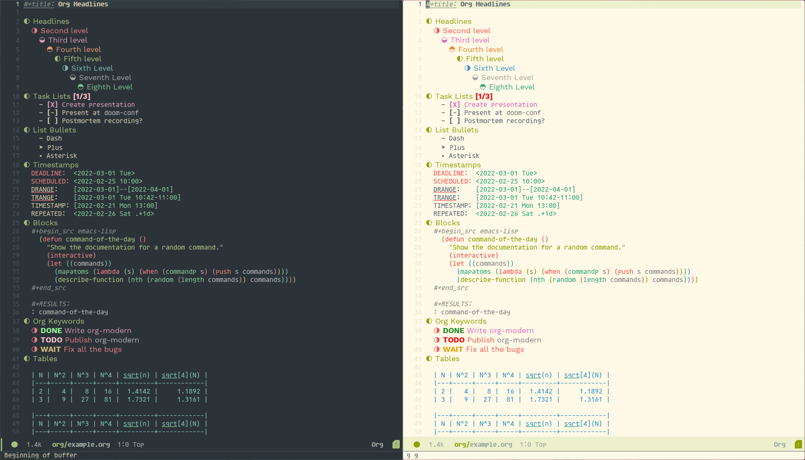

# Everforest Emacs Theme

An Emacs port of the [Everforest](https://github.com/sainnhe/everforest) Vim
theme, a low-contrast green-coloured theme. This is a current work in progress,
so expect issues and unorthodox coloring occasionally. The port is quite
opinionated from the original everforest theme, but I try to keep as true to the
original theme as possible, but making changes where needed for both functional
and cosmetic reasons.

- [sourcehut mirror](https://git.sr.ht/~theorytoe/everforest-theme)



## Installation
   
This theme is not on MELPA (yet), so a manual install is required
for stock emacs.

### straight.el

```elisp
(straight-use-package
  '(everforest) :type git :repo "https://git.sr.ht/~theorytoe/everforest-theme")

(load-theme 'everforest-hard-dark t)
;; (load-theme 'everforest-hard-light t)
```

### Doom Emacs (package!)

```elisp
(package! everforest
  :recipe (:repo "https://git.sr.ht/~theorytoe/everforest-theme"))
  
(use-package! 'everforest')

(load-theme 'everforest-hard-dark t)
;; (load-theme 'everforest-hard-light t)
```

### Manual

Clone the Repo

```bash
git clone https://git.sr.ht/~theorytoe/everforest-theme ~/.emacs.d/everforest-theme
```

Add the theme to your custom-theme alist and load it

```elisp
(add-to-list 'custom-theme-load-path "~/.emacs.d/everforest")
(load-theme 'everforest-hard-dark t)
```

### Usage

Load the theme (disable any existing theme):

```
M-x load-theme RET everforest-hard-dark RET
```

To load the theme on emacs startup:

```elisp
(load-theme 'everforest-hard-dark t)
```

# Roadmap

Currently, both the dark and light (high-contrast/hard) schemes
have been ported. Support for both soft and medium will eventually
arrive once most of the internal code has been cleaned up.
